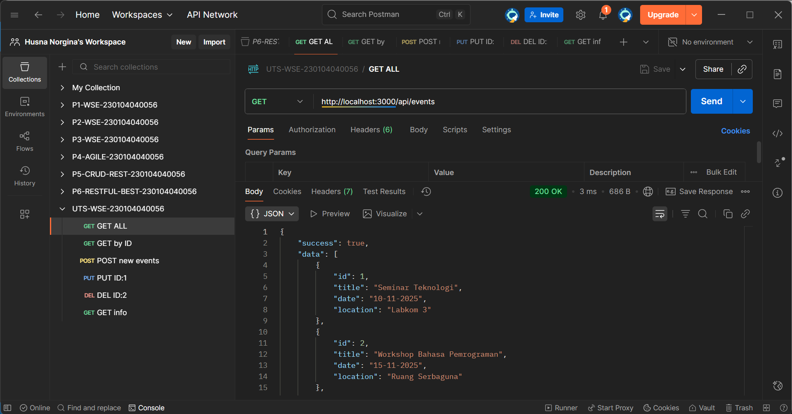
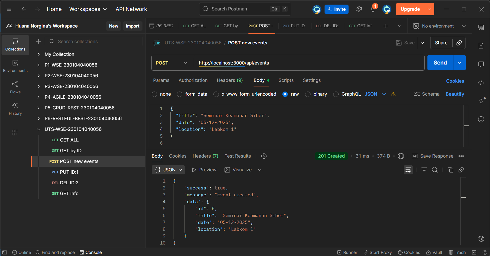
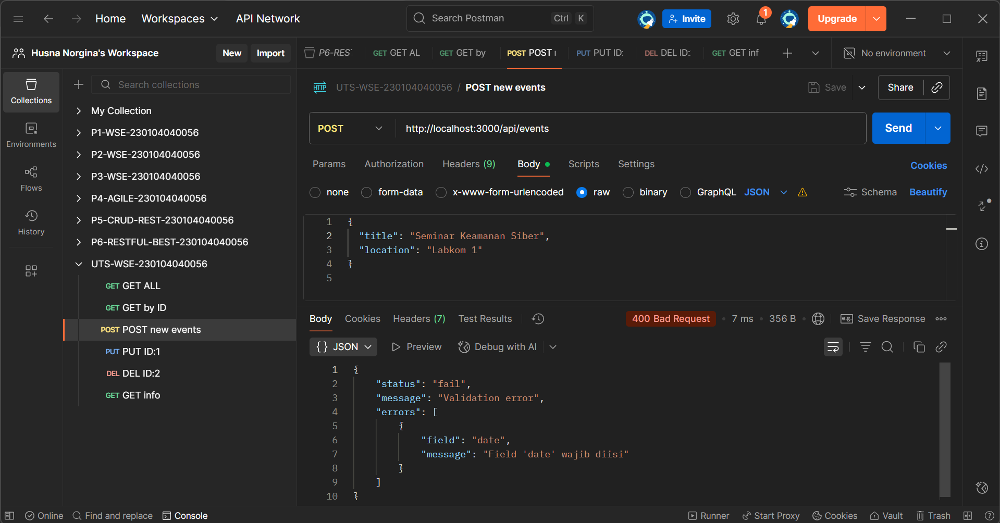
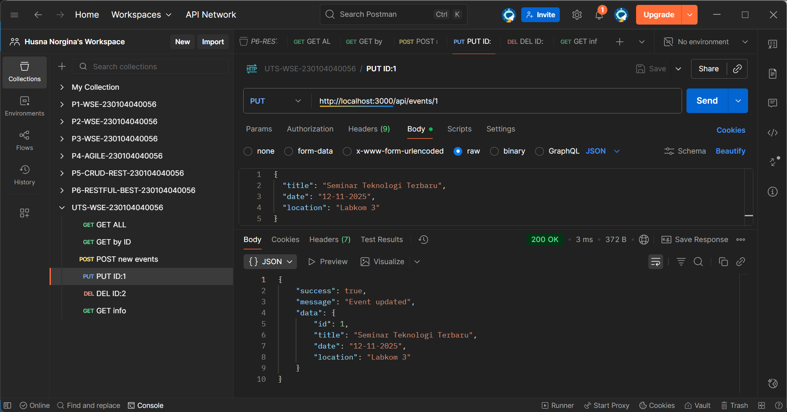
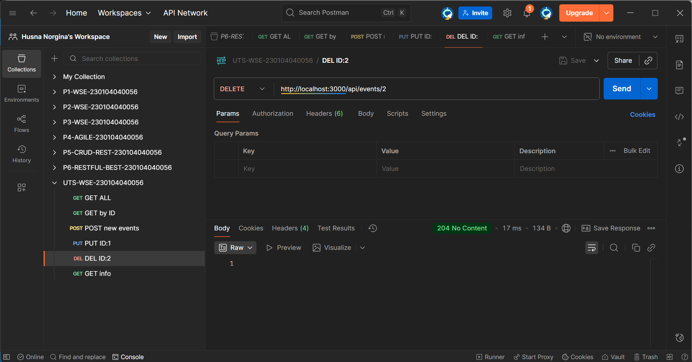
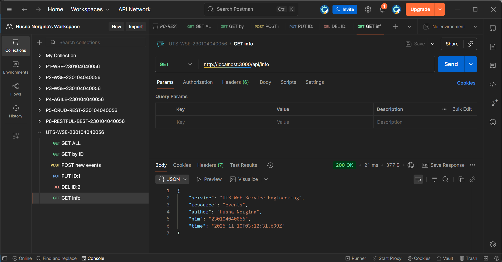

# 🌐 UTS — RESTful API Events (Express.js)

UTS ini membahas **pembangunan RESTful API** menggunakan **Node.js dan Express.js** dengan satu resource utama yaitu **events**.
API menerapkan **CRUD lengkap**, **validasi input**, **error handling**, serta **7 RESTful Principles** sesuai dengan materi yang telah dipelajari pada Praktikum 5 dan 6.

**Topik:** UTS Web Service Engineering — RESTful API Events

---

## 🧑‍🎓 Informasi Mahasiswa

| Informasi          | Data                                                               |
|--------------------|--------------------------------------------------------------------|
| Mata Kuliah        | Web Service Engineering                                            |
| Dosen Pengampu     | Muhayat, M.IT                                                      |
| Proyek             | UTS                                                                |
| Nama Mahasiswa     | Husna Norgina                                                      |
| NIM                | 230104040056                                                       |
| Kelas              | TI23B                                                              |
| Digit Akhir NIM    | 6                                                                  |
| Resource           | events                                                             |
| Field Utama        | title, date, location                                              |
| Repo GitHub        | https://github.com/husna-norgina/UTS-WSE-230104040056              |
| Tanggal Praktikum  | 10-11-2025                                                         |  

---

## 🎯 Tujuan UTS

1. Mendesain endpoint RESTful untuk resource **events**.
2. Mengimplementasikan **CRUD lengkap** menggunakan Express.js.
3. Menggunakan **HTTP Method dan Status Code** sesuai standar REST.
4. Menerapkan **validasi input dan error handling**.
5. Menyajikan response dalam format **JSON terstruktur**.
6. Menyusun struktur project yang **modular dan rapi**.
7. Menerapkan **7 RESTful Principles** secara eksplisit.

---

## 🛠 Tools & Environment

* Node.js
* Express.js
* Visual Studio Code
* Postman
* Git & GitHub

---

## 🧱 Arsitektur Sistem

**Alur Sistem:**

* Client (Postman)
* API Server (Express.js)
* Router Events
* Validasi & Error Handling
* Data sementara (in-memory)
* Response JSON ke client

Arsitektur menggunakan pola **Client–Server**.

---

## 🔁 Pengujian & Implementasi API

---

### 🔵 1. GET — Ambil Semua Events

| Method | Endpoint      | Keterangan                 |
| ------ | ------------- | -------------------------- |
| GET    | `/api/events` | Menampilkan seluruh events |

**Hasil:**

Menampilkan seluruh data events dalam format JSON.
Server merespons status `200 OK`.

---

### 🔵 2. GET — Ambil Event Berdasarkan ID

| Method | Endpoint        | Keterangan                 |
| ------ | --------------- | -------------------------- |
| GET    | `/api/events/1` | Menampilkan event tertentu |

**Hasil:**

Menampilkan event berdasarkan ID tertentu.
Server merespons status `200 OK`.

---

### 🔵 3. POST — Tambah Event Baru (Berhasil)

| Method | Endpoint      | Keterangan             |
| ------ | ------------- | ---------------------- |
| POST   | `/api/events` | Menambahkan event baru |

**Hasil:**

Event berhasil ditambahkan ke server.
Server merespons status `201 Created`.

---

### 🔴 4. POST — Tambah Event (Gagal Validasi)

| Method | Endpoint      | Keterangan     |
| ------ | ------------- | -------------- |
| POST   | `/api/events` | Validasi gagal |

**Hasil:**

Request ditolak karena data tidak valid.
Server merespons status `400 Bad Request`.

---

### 🔵 5. PUT — Update Event

| Method | Endpoint        | Keterangan        |
| ------ | --------------- | ----------------- |
| PUT    | `/api/events/1` | Update data event |

**Hasil:**

Data event berhasil diperbarui.
Server merespons status `200 OK`.

---

### 🔵 6. DELETE — Hapus Event

| Method | Endpoint        | Keterangan      |
| ------ | --------------- | --------------- |
| DELETE | `/api/events/2` | Menghapus event |

**Hasil:**

Event berhasil dihapus.
Server merespons status `204 No Content`.

---

### 🔵 7. GET — Info API

| Method | Endpoint    | Keterangan   |
| ------ | ----------- | ------------ |
| GET    | `/api/info` | Metadata API |

**Hasil:**

Menampilkan informasi metadata service API.
Server merespons status `200 OK`.

---

## 📄 Laporan UTS

[230104040056_Husna_Norgina_UTS.pdf](<evidence/230104040056_Husna_Norgina_UTS.pdf>)

---

> Semua screenshot hasil uji endpoint dan laporan praktikum disimpan pada folder:  
> 📂 `./evidence/`

---

## 📊 Analisis UTS

* Semua endpoint CRUD berjalan dengan baik.
* Validasi input mencegah data tidak valid.
* Status code HTTP digunakan sesuai standar REST.
* Response JSON konsisten dan mudah dibaca.
* Endpoint `/api/info` menyediakan metadata service.
* Struktur project modular dan rapi.

---

## ✅ Kesimpulan

Berdasarkan hasil UTS, RESTful API untuk resource **events** berhasil dibangun menggunakan Express.js. Seluruh operasi CRUD berjalan sesuai spesifikasi, dilengkapi validasi input dan error handling. Status code HTTP digunakan secara konsisten, response disajikan dalam format JSON, dan endpoint `/api/info` tersedia sebagai metadata service. Dengan demikian, **7 RESTful Principles telah diterapkan secara lengkap** pada proyek ini.

---

## 📌 Catatan

* Data disimpan sementara (in-memory).
* Pengujian dilakukan menggunakan Postman.
* API dikembangkan untuk keperluan UTS dan pembelajaran.

---

📝 *Disusun oleh Husna Norgina (230104040056) — UTS Web Service Engineering*
